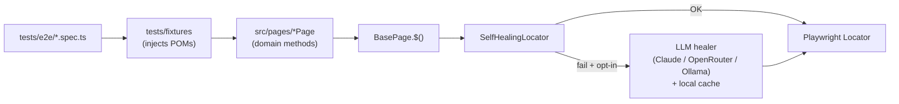

# Playwright QA Framework — with Self-Healing AI

End-to-end automation suite for [qa-practice.netlify.app](https://qa-practice.netlify.app), built with **Playwright (TypeScript)** and an opt-in **Claude-powered self-healing locator layer** that repairs broken selectors at runtime.

> Built for the QA Automation Code Challenge 2026.

---

## What's inside

- **Playwright 1.59** in TypeScript, strict mode, with path aliases and a thin Page Object Model.
- **Self-healing AI** — when a selector fails, an LLM healer (Claude / OpenRouter / Ollama) inspects the DOM, suggests a replacement, retries the action, and caches the result. Off by default; budget-capped; never silent.
- **Multi-browser + mobile** — Chromium, Firefox, WebKit on desktop; Pixel 5 + iPhone 13 viewports for mobile smoke checks.
- **Accessibility** — `@axe-core/playwright` WCAG 2.1 A + AA scans on the four key pages, with a `critical`-impact gate.
- **API + network resilience** — direct HTTP via `APIRequestContext`, captured request/response shapes from real flows, and route-mocking / offline / slow-network simulation. See [How-to: API & network](./docs/how-to-api-testing.md).
- **Performance** — Lighthouse audits (`playwright-lighthouse`) + hand-rolled Core Web Vitals on the four key pages, with tunable budgets. See [How-to: Performance](./docs/how-to-performance-testing.md).
- **Security smoke** — XSS / SQLi smoke checks against form inputs to verify they're treated as text and don't reflect into the DOM.
- **Tag-driven slices** — `@smoke` / `@critical` / `@regression` / `@a11y` / `@api` / `@network` / `@perf` / `@security` for fast PR gates and full nightly runs.
- **Dual reporting** — Playwright HTML for trace debugging, Allure for trends, with traces and videos retained on failure.
- **Stability sweep** — repeats the suite N× with retries disabled to surface flakes instead of hiding them. See [STABILITY.md](./STABILITY.md).
- **GitHub Actions** matrix CI + dedicated performance job + **Docker** + **docker-compose** for hermetic runs.

---

## Quickstart

```bash
git clone <your-fork-url>
cd playwright-qa-framework
npm ci
npx playwright install --with-deps
npm run test:smoke
```

That gets you a green run on Chromium in about a minute. Then:

```bash
npm run report           # open the HTML report from the last run
npm test                 # full suite, three browsers
```

To watch the AI heal a deliberately broken selector in your browser, follow the **[Tutorial](./docs/tutorial.md)** — about ten minutes end to end.

---

## Documentation

This README is the entry point. The rest of the documentation is in `docs/`, organised by what you're trying to do:

- **[Tutorial](./docs/tutorial.md)** — first run + watch the self-healing demo.
- **[How-to guides](./docs/how-to.md)** — focused subsets, AI healing, Docker, CI, troubleshooting.
- **[How-to: API & network testing](./docs/how-to-api-testing.md)** — direct HTTP, captured traffic, route mocking, offline.
- **[How-to: Performance testing](./docs/how-to-performance-testing.md)** — Lighthouse + Web Vitals, threshold tuning.
- **[Reference](./docs/reference.md)** — every npm script, env var, tag, and spec.
- **[Explanation](./docs/explanation.md)** — design decisions and the reasoning behind them.
- **[Stability](./STABILITY.md)** — measuring and triaging flaky tests.

Browse them in any order — the four are independent and link between themselves where needed.

---

## Architecture



For a deeper walk through this diagram and the reasoning behind each layer, see the [Explanation](./docs/explanation.md).

---

## Prerequisites

- Node.js 18+ (CI uses 20).
- npm 9+.
- macOS, Linux, or Windows. Docker optional but recommended for hermetic runs.

## License

MIT.
